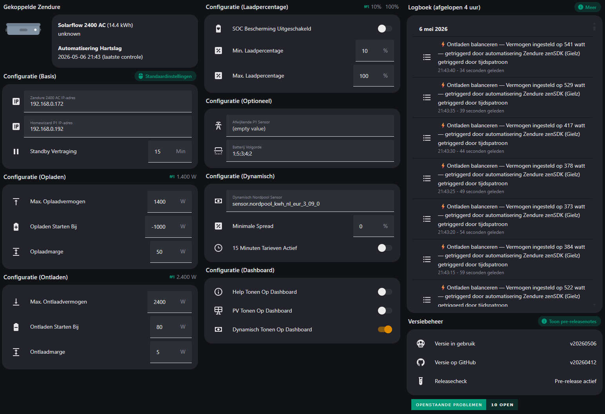

#  Zendure Home Assistant Integratie
[](https://github.com/Gielz1986/Zendure-HA-zenSDK/releases)
[](https://github.com/Gielz1986/Zendure-HA-zenSDK/issues)
[](https://github.com/Gielz1986/Zendure-HA-zenSDK/issues)

## Verschillen in deze fork

Deze fork behoudt een paar lokale wijzigingen ten opzichte van `Gielz1986/Zendure-HA-zenSDK`:

- `dynamisch_minimale_spread` gebruikt een absolute spread in `ct/kWh`, geen percentage. AppDaemon gebruikt 2 ct/kWh als de persistente Home Assistant-helper tijdelijk geen geldige waarde heeft.
- `sensor.dynamisch_spread_indicatie`, `sensor.dynamisch_spread_indicatie_nom`, `sensor.dynamisch_spread_indicatie_morgen`, en `sensor.dynamisch_spread_indicatie_nom_morgen` berekenen spread met `(gemiddelde dure prijs - gemiddelde goedkope prijs) * 100`, zodat de sensorwaarde past bij `unit_of_measurement: "ct/kWh"`.
- `appdaemon/apps/dynamisch_handelen.py` rekent 72 uur vooruit. Echte 15-minutenprijzen uit `raw_today` en `raw_tomorrow` houden voorrang; na het laatste bronkwartier gebruikt de strategie WattWanneer-uurprijzen die met overlappende `entsoe_day_ahead`-uren op de prijsbasis van de ingestelde Nordpool-sensor worden gekalibreerd. Ontbrekende uren krijgen een fallback op basis van het gemiddelde van maximaal de laatste 24 uur geldige bronkwartieren.
- `appdaemon/apps/wattwanneer_forecast.py` bewaart de gesaneerde WattWanneer-forecast, iedere echte ophaalpoging, iedere succesvolle forecastsnapshot, Nordpool-kwartierprijsversies en de toegepaste prijsbasiskalibratie in `/share/zendure_kwartieren.sqlite`. Na succes haalt AppDaemon maximaal eens per 12 uur op; na een fout maximaal eens per 2 uur, ook over Home Assistant- en AppDaemon-herstarts heen.
- `appdaemon/apps/kwartieradministratie.py` bewaart Zonneplan-kwartierprijzen en gemeten Zendure-import/export idempotent in `/share/zendure_kwartieren.sqlite`; de aparte SQL-sensoren tonen importkosten, exportopbrengst en netto handelsresultaat zonder afhankelijk te blijven van gepurgede kwartierhistorie.
- `.DS_Store` bestanden worden genegeerd met `.gitignore`, zodat macOS metadata-bestanden buiten commits blijven.

### Historische prijsbrondata voor backtests

De SQLite-database `/share/zendure_kwartieren.sqlite` bevat naast de bestaande `zendure_quarters`-administratie vier tabellen voor de prijsinputs van de strategie:

- `wattwanneer_forecast_fetches`: één regel per uitgevoerde HTTP-poging, met starttijd, eindtijd, status, foutmelding en aantal ontvangen forecastregels.
- `wattwanneer_forecast_history`: alle prijsregels van iedere succesvolle fetch, gekoppeld via `fetch_id`. Iedere regel bevat de ophaaltijd, het voorspelde begin en einde van het uur, de oorspronkelijke lokale `datetime`, `price_eur_kwh`, `source` en `generated_at`. De p10- en p90-waarden worden niet opgeslagen.
- `nordpool_quarter_price_history`: de geldige 15-minutenprijzen uit `raw_today` en `raw_tomorrow`. Een ongewijzigde prijs verhoogt `observation_count`; een gewijzigde prijs voor hetzelfde kwartier maakt een nieuwe `price_version_id`, zodat correcties bewaard blijven.
- `wattwanneer_price_calibration_history`: de factor, EUR/kWh-opslag, maximale restfout en het aantal overlapuren dat een strategierun gebruikte om WattWanneer op de ingestelde Nordpool-sensor te kalibreren. `forecast_fetch_id` verwijst naar de gebruikte forecastsnapshot.

De tabellen worden niet automatisch opgeschoond. Epoch-kolommen zijn geschikt voor tijdsfilters en indexen; de bijbehorende `*_utc` en `*_iso` kolommen maken handmatige inspectie leesbaar. Wanneer de forecast-, Nordpool- of kalibratiehistorie niet kan worden opgeslagen, publiceert `sensor.wattwanneer_forecast_status` de status `fout`, waardoor de rode dashboardmelding zichtbaar wordt.

## Lokaal deployen naar Home Assistant

Gebruik `scripts/deploy_ha.sh` om AppDaemon-bestanden en package YAML via SSH naar Home Assistant te kopieren.

Maak eerst een lokale `.env`:

```bash
cp .env.example .env
```

Vul daarna in `.env` minimaal `HA_SSH_HOST` in:

```bash
HA_SSH_HOST=homeassistant.local
HA_SSH_USER=root
HA_SSH_PORT=22
HA_CONFIG_DIR=/config
HA_URL=http://homeassistant.local:8123
HA_TOKEN=
HA_APPDAEMON_ADDON_SLUG=a0d7b954_appdaemon
```

Maak in Home Assistant een long-lived access token via je profielpagina en zet dat token in `HA_TOKEN`. `scripts/deploy_ha.sh` gebruikt `HA_TOKEN` voor `POST /api/services/homeassistant/reload_all`.

Controleer de kopieeractie zonder bestanden te wijzigen en zonder Home Assistant YAML te reloaden:

```bash
scripts/deploy_ha.sh --dry-run
```

Kopieer de bestanden, controleer de Home Assistant YAML-configuratie, reload Home Assistant YAML, en herstart AppDaemon:

```bash
scripts/deploy_ha.sh
```

`scripts/deploy_ha.sh` schrijft deze Home Assistant bestanden:

- `/config/appdaemon/apps/apps.yaml`: vervangt alleen de top-level secties `dynamisch_handelen:` en `zendure_kwartieradministratie:` en laat andere AppDaemon apps in `apps.yaml` staan.
- `/config/appdaemon/apps/dynamisch_handelen.py`
- `/config/appdaemon/apps/strategie_dp.py`
- `/config/appdaemon/apps/wattwanneer_forecast.py`
- `/config/appdaemon/apps/kwartieradministratie.py`
- `/config/packages/zendure_gielz1986_nl.yaml`
- `/config/packages/zendure_local_nl.yaml`
- `/config/packages/zendure_kwartieradministratie_nl.yaml`

Na het kopieren voert `scripts/deploy_ha.sh` `ha core check` uit. Wanneer `ha core check` slaagt, voert `scripts/deploy_ha.sh` `POST /api/services/homeassistant/reload_all` uit via `HA_URL` en `HA_TOKEN`. Wanneer `ha core check` faalt, stopt `scripts/deploy_ha.sh` zonder YAML reload en zonder AppDaemon restart.

`scripts/deploy_ha.sh` herstart AppDaemon met `ha apps restart a0d7b954_appdaemon`. Zet `HA_APPDAEMON_ADDON_SLUG` in `.env` wanneer jouw AppDaemon app slug anders is. Start `scripts/deploy_ha.sh --no-restart` wanneer je AppDaemon niet wilt herstarten na een geslaagde `ha core check` en YAML reload.

`scripts/deploy_ha.sh` kopieert `Dutch (NL) Integration/automation_nl.yaml`, `Dutch (NL) Integration/dashboard_nl.yaml`, en `Dutch (NL) Integration/dashboard_strategie.yaml` niet. Beheer deze drie YAML-bestanden handmatig in Home Assistant.

 <br>
<sub>
<a href="https://github.com/Gielz1986/Zendure-HA-zenSDK/wiki/NL-%E2%80%90-Beschikbare-entiteiten">
Ga naar de uitleg over alle entiteiten en het dashboard
</a>
</sub>

<br>

**Om in slechts 2️⃣ simpele stappen je batterij volledig lokaal werkend te krijgen in Home Assistant.**

Gebaseerd op de zenSDK RESTful API voor Home Assistant. Deze package maakt lokaal verbinding met één Zendure Solarflow 2400 (AC, AC+ of AC Pro) / Zendure Solarflow 1600 AC+ / Zendure Solarflow 800 (Pro(2) of Plus) / Zendure Solarflow 3000 Mix AC+ / Zendure Solarflow 4000 Mix (AC+ of Pro). Perfect voor iedereen die zijn batterij **100% lokaal en volledig onder eigen controle** wil draaien in Home Assistant. Inmiddels zijn er **11 voorgeprogrammeerde modussen**  — van heerlijk NOMen op basis van de grote vuurbal tot energieboer spelen met dynamisch handelen voor een paar stuivers.

Heb je de smaak te pakken en meerdere omvormers staan? Dan kun je dit uitbreiden met de [Node-RED proxy van Gast777](https://github.com/gast777/Zendure-zenSDK-proxy). Met deze proxy zorgt Node-RED ervoor dat alles binnen deze automatisering naadloos samenwerkt, waardoor meerdere identieke omvormers slim worden aangestuurd met een optimale vermogensverdeling.

Vind je dit project nuttig en wil je verdere ontwikkeling supporten? <br>
Trakteer mij op een kopje koffie ☕️ en volg deze GitHub repository ⭐⭐⭐.

<a href="https://www.buymeacoffee.com/gielz" target="_blank">
  
</a><br><br>


## 1️⃣ Entiteiten beschikbaar maken

#### ℹ️ Benodigde hardware

- Homewizard P1 (of een andere P1/CT-meter die data per seconden levert (+watt afname / -watt teruglevering).
- één Solarflow 2400 (AC, AC+ of AC Pro) / Solarflow 1600 AC+ / Solarflow 800 (Pro(2) of Plus) / Solarflow 3000 Mix AC+ / Solarflow 4000 Mix (AC+ of Pro).
- Of twee dezelfde omvormers in combinatie met de [Node-RED proxy van Gast777](https://github.com/gast777/Zendure-zenSDK-proxy)

---

### #️⃣ Configuratie en herstart

1. Zorg ervoor dat **HEMS is uitgeschakeld** in de Zendure-app.
2. Plaats [Zendure_gielz1986_nl.yaml](./Dutch%20(NL)%20Integration/packages/zendure_gielz1986_nl.yaml) uit de map packages van GitHub in de map packages van Home Assistant. Mocht de map packages niet bestaan maak deze dan aan.
3. Maak nu een **backup** van je `configuration.yaml`.
4. Pas daarna je `configuration.yaml` aan door de onderstaande regel toe te voegen.

```
homeassistant:
  packages: !include_dir_named packages
```

|  |
|-----------------------------------|

5. Herstart Home Assistant.
6. Optioneel kun je nu het plug-n-play dashboard aanmaken [Ga naar Plug-N-Play Dashboard](#-optioneel-plug-n-play-dashboard). Of vul nu bij de onderstaande entiteiten in Home Assistant de juiste gegevens in en herstart Home Assistant nogmaals.

---


 

<sub>*plug-n-play dashboard</sub>

<br>

| Uitleg per configuratie item | |  
|-|-|
| **Configuratie (Basis)** | **Informatie**|  
| `zendure_2400_ac_ip_adres`       | **bijvoorbeeld 192.168.0.172** – In de Zendure app onder device Information. |  
| `homewizard_p1_ip_adres`    | **(Instellingsadvies: gebruik een Homewizard P1) bijvoorbeeld 192.168.0.192** – In de Homewizard app (lokale API aanzetten).  |  
| `zendure_2400_ac_standby_vertraging` | **(Instellingsadvies: 15 minuten) 5-30 minuten** – Geef hier aan hoe snel de omvormer 100% in standby gaat bij 0 activiteit. Dit voorkomt sluipverbruik van +/- 19 watt. | 
| `zendure_2400_ac_advies_instellingen_overnemen` | Zodra de batterij draait kun je met deze knop de onderstaande instellingsadviezen direct overnemen. | 
| **Configuratie (Opladen)** |**Informatie**|  
| `zendure_2400_ac_max_oplaadvermogen`    | **400 t/m 2400 watt** – Geef hier aan met hoeveel vermogen hij maximaal mag laden. Bij meerdere omvormers via Node-RED kan dit tot 7200 watt.  |  
| `zendure_2400_ac_opladen_starten_bij` | **(Instellingsadvies: -300 watt) -1000 t/m -80 watt** – hier geef je aan wanneer de batterij exact begint met opladen. Daarna balanceert de batterij naar 0 - de extra oplaadmarge.  | 
| `zendure_2400_ac_oplaadmarge` | **(Instellingsadvies: 50 watt) 0 t/m 250 watt** – Geef hier aan hoeveel minder je wilt meenemen tijdens opladen. Als je wat minder wilt opladen, in de zomer met voldoende opwek zou je dit zelfs op 200 kunnen zetten om import overdag 100% te voorkomen. (Zendure zelf hanteert hier 50 watt in HEMS).  | 
| **Configuratie (Ontladen)** |**Informatie**|  
| `zendure_2400_ac_max_ontlaadvermogen`    | **400 t/m 2400 watt** – Geef hier aan met hoeveel vermogen hij maximaal mag ontladen. Bij meerdere omvormers via Node-RED kan dit tot 7200 watt. |  
| `zendure_2400_ac_ontladen_starten_bij` | **(Instellingsadvies: 100 watt) 80 t/m 500 watt** – hier geef je aan wanneer de batterij exact begint met ontladen. Daarna balanceert de batterij naar 0 - de extra ontlaadmarge. | 
| `zendure_2400_ac_ontlaadmarge` | **(Instellingsadvies: 5 watt) 0 t/m 250 watt** – Geef hier aan hoeveel je extra wilt meenemen tijdens ontladen. Als je wat meer wilt ontladen dan noodzakelijk is. |
| **Configuratie (Laadpercentage)** |**Informatie**|  
| `zendure_2400_ac_soc_bescherming_uitgeschakeld`    | Vink dit aan om de dubbele SOC bescherming uit te schakelen. Wanneer de batterij onder het minimaal toegestaan laadpercentage zakt zal er niet meer automatisch bijgeladen worden. Er word gewacht tot de BMS (batterij management systeem) zelf actie onderneemt. |  
| `zendure_2400_ac_minimaal_toegestaan_laadpercentage` | **(Instellingsadvies: 10%) 5% t/m 50%** – Geef hier het minimaal toegestaan laadpercentage aan. | 
| `zendure_2400_ac_maximaal_toegestaan_laadpercentage` | **(Instellingsadvies: 100%) 70% t/m 100%** – Geef hier het maximaal toegestaan laadpercentage aan. Bij 100% vind er een SOC kalibratie plaats om het laadpercentage goed te kunnen inschatten. | 
| **Configuratie (Optioneel)** |**Informatie**|  
| `afwijkende_p1_sensor` | **bijvoorbeeld `sensor.eigen_P1`** – je eigen afwijkende P1 sensor toevoegen waarbij +watt afname is en -watt teruglevering (vul je hier je eigen sensor in dan is deze altijd leidend). [Ga naar WIKI](https://github.com/Gielz1986/Zendure-HA-zenSDK/wiki/Global-and-NL-%E2%80%90-P1-CT-meters-(API's))) voor afwijkende P1/CT API's. |  
| `zendure_2400_ac_batterij_volgorde` | **bijvoorbeeld 1;5;3;4;2** – hiermee bepaal je zelf een afwijkende volgorde van de batterijen. De juiste volgorde bepaal je mede aan de hand van `sensor.zendure_2400_ac_batterij_serienummers` en de sticker op de batterij(en). Op deze manier zullen de batterijtemperaturen en het laadpercentage de juiste volgorde hebben zoals die van de batterij(en) in de stapel. | 
| **Configuratie (Dynamisch)** |**Informatie**|  
| `dynamisch_nordpool_sensor` | **bijvoorbeeld `sensor.nordpool_kwh_nl_eur_3_09_0`** – je eigen sensor van Nordpool (HACS) toevoegen. Wanneer je het Dynamisch Nordpool gedeelte in gebruik gaat nemen moet je voor dat je deze in gebruik neemt bij `dynamisch_handmatige_periode` en `dynamisch_handmatige_periode_morgen` even **unknown** weghalen. Hierna zal het dynamisch gedeelte werken. Alles wat in de forecast (morgen) gezet word zal overgenomen worden om 00:00 via de automatisering en verschijnen in vandaag. |  
| `dynamisch_minimale_spread` | **Instellingsadvies: 2 ct/kWh** – extra marge boven op het al meegerekende round-trip rendementsverlies. Home Assistant bewaart de gekozen waarde bij herstarts; 0 ct/kWh blijft mogelijk. |
| `dynamisch_minimum_vermogen_w` | Laagste laad- of ontlaadopdracht die de DP-strategie mag kiezen; rust met 0 W blijft altijd mogelijk. |
| `dynamisch_15_minuten` | Vink dit aan wanneer je gebruik wilt maken van 15 minuten periodes.  |  
| **Configuratie (Dashboard)** |**Informatie**|  
| `help_tonen_op_dashboard` | Vink dit aan om de helpteksten te tonen bij de meest relevante onderdelen.  | 
| `pv_tonen_op_dashboard` | Vink dit aan om de verbonden (offgrid/mppt) PV te tonen op het dashboard.  |  
| `dynamisch_tonen_op_dashboard` | Vink dit aan om de dynamische sturing te tonen op het dashboard.  |  

<br>

## 2️⃣ Zendure zenSDK (Gielz) automatisering
De motor van alles: hij laadt slim op, ontlaadt slim, en zorgt dat alles samenwerkt. Kies uit 11 verschillende modi om hem precies zo te laten werken als jij wilt. Heb je bij het bovenstaande geen namen aangepast dan is het een kwestie van deze nieuwe automatisering aanmaken.

1. Maak een nieuwe automatisering aan.
2. Klik rechtsboven op **Bewerken in YAML**.
3. Plak de YAML-code uit het [Automation_nl.yaml](./Dutch%20(NL)%20Integration/automation_nl.yaml) bestand van deze GitHub.   
4. Sla op, en start de automatisering.

   

 

<br>

## ✅ Batterij mag aan de slag
Het moment is aangebroken: de batterij mag nu bewijzen dat hij meer is dan alleen een dure decoratie met kabels.

1. Open het plug-n-play dashboard of voeg de entiteit **Zendure 2400 AC Modus Selecteren** toe aan je eigen dashboard.
3. De modus zal op **Standby** staan.
4. Kies hier je gewenste modus om de **Zendure zenSDK (Gielz) automatisering** te activeren.
5. De batterij zal nu aan de slag gaan.

 <br>
<sub>
<a href="https://github.com/Gielz1986/Zendure-HA-zenSDK/wiki/NL-%E2%80%90-Modussen">
Ga naar de uitleg over alle verschillende modussen
</a>
</sub>

<br>

## 🔃 (Optioneel) Plug-N-Play Dashboard
Vanaf nu is het ook mogelijk om direct een volledig plug-n-play dashboard in gebruik te nemen.

1. Voor dit dashboard is [Apexcharts HACS](https://github.com/RomRider/apexcharts-card) vereist. En (optioneel) [Graphite HACS](https://github.com/TilmanGriesel/graphite).
2. Maak een nieuw leeg dashboard aan via links onderin op ⚙️ te klikken en ga dan naar **Dashboards**.
3. Klik vervolgens op **Dashboard toevoegen** en kies voor **leeg nieuw dashboard**.
4. Open het nieuwe dashboard.
5. Klik rechtsboven op de 3 puntjes en kies **Dashboard bewerken**
6. Klik rechtsboven op de 3 puntjes en kies **Ruwe configuratie-editor**.
7. Plak de YAML-code uit het [Dashboard_nl.yaml](./Dutch%20(NL)%20Integration/dashboard_nl.yaml) bestand van deze GitHub.
8. Sla op en het dashboard is volledig bruikbaar.
9. [Ga naar de WIKI](https://github.com/Gielz1986/Zendure-HA-zenSDK/wiki/NL-%E2%80%90-Beschikbare-entiteiten) om uitleg te krijgen over alle entiteiten.

 
